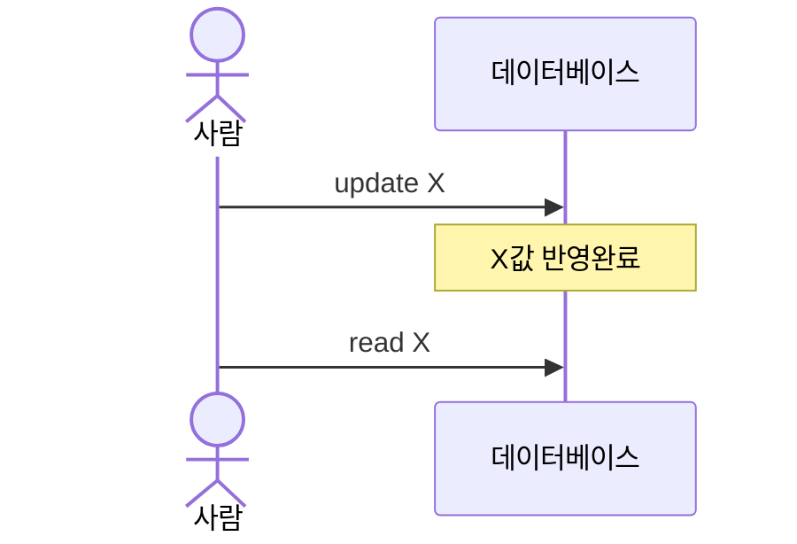
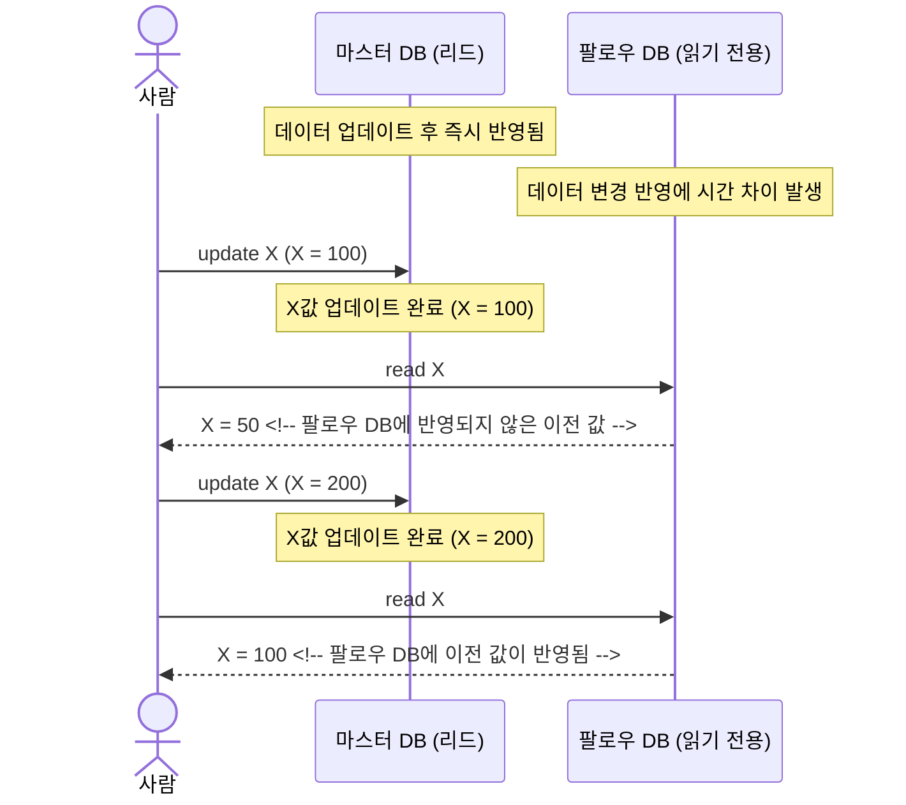
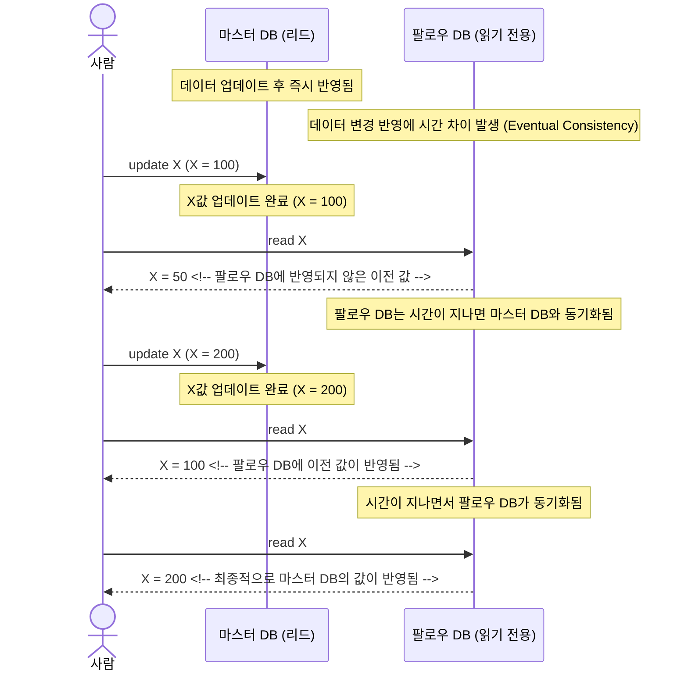
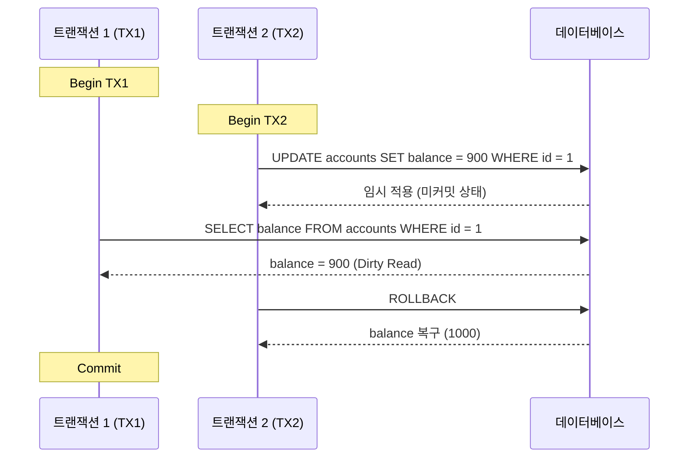
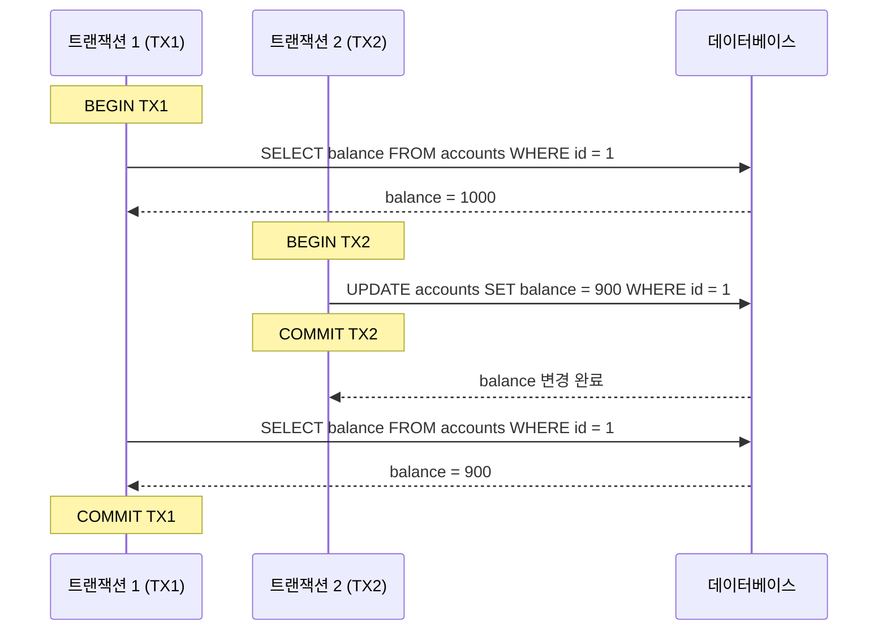
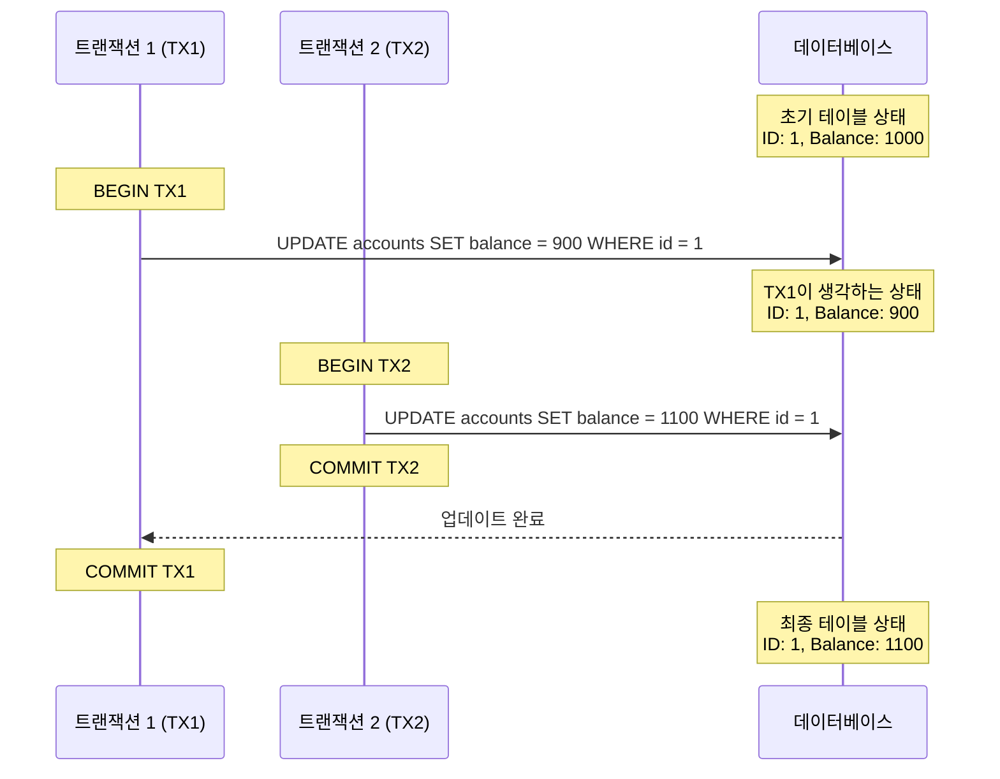
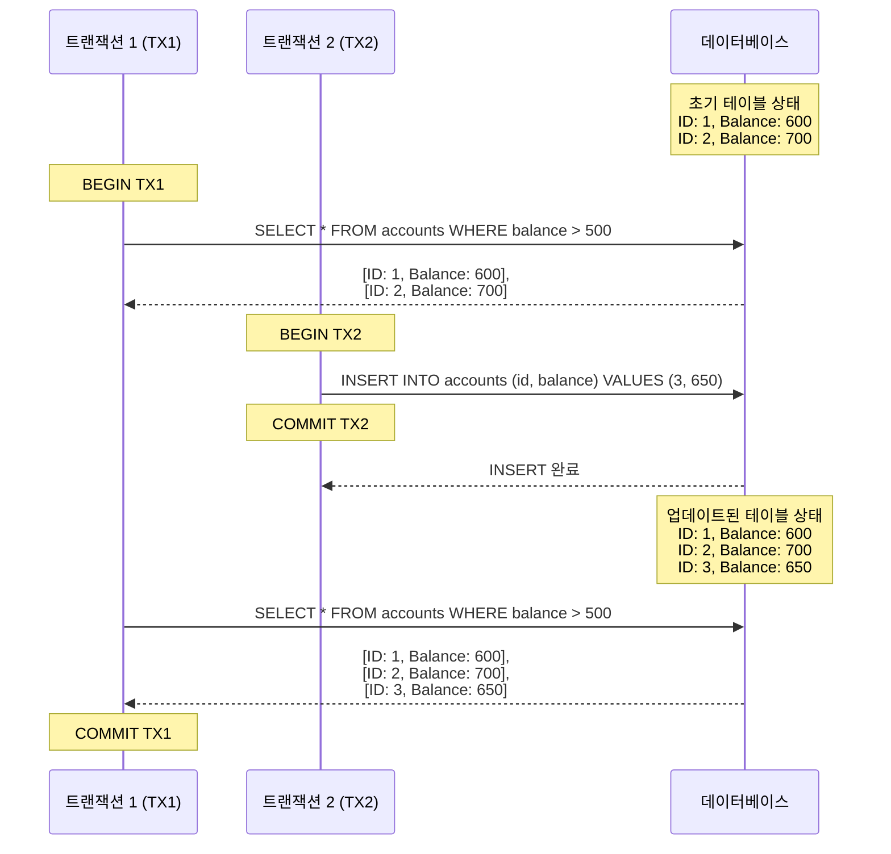

## What's a Transaction?
트랜잭션은 하나의 작업 단위이다. SQL 쿼리 하나도 작업 단위 일 수 있으며, 은행 송금과 같이 `인출 -> 전달 -> 입금`까지의 과정이 트랜잭션이 되기도 한다.

- one unit of work
- a collection of queries

### Life
- Transaction BEGIN
- Transaction COMMIT
- Transaction ROLLBACK
- Transaction unexpected ending = ROLLBACK(e.g. crash)

아무 문제가 없다면 COMMIT으로 끝내고 만약 다시 되돌리고 싶다면 ROLLBACK을 실행하면 된다.
트랜잭션 실행 중 예상치 못하게 DB가 다운된다면 자동으로 ROLLBACK되거나 각 RDBMS의 정책대로 흘러간다.

트랜잭션은 아래의 4가지 성질 ACID를 가지고 있다.
## Atomicity
원자성 단어 그대로 나뉘어 지지 않는다는 뜻이다. ~~(up quark, down quark로 구성 되어 있지만 ^^7)~~

만약 트랜잭션 쿼리 실행 중 하나의 쿼리라도 실패가 되거나, 갑자기 DB가 다운된다면 트랜잭션은 롤백이되거나 실패해 다시 시작 해야한다.

만약 원자성이 보장되지 않는 다면, 송금 간 본인 계좌의 돈은 인출이 됐지만 상대방 계좌에 입금 전 시스템이 종료되면 돈이 인출만 되고 입금이 되지 않는 상황이 발생할 것이다.

## Consistency
일관성

일관성은 두 가지 관점으로 나눌 수 있다.
### Data
데이터는 데이터 베이스 사용자에 의해 정의 된다. 외래키의 일관성, 원자성, 고립성.
데이터는 이러한 내용으로 일관성을 가지게 되며 고립성은 고립수준(isolation level)에 따라 달라진다.

**외래키 일관성의 예시**

_일관적인 외래키_

_비일관적인 외래키_
### Read

읽기에서 일관성은 위와 같이 값을 업데이트 하게 되면 읽을 때도 일관되게 업데이트한 값을 읽어야 한다.

하지만 만약에 데이터베이스가 여러개이고 동기화를 한다면 이걸 만족할 수 있을 까? 아래와 같이 아마 동작할 것이다.

위와 같이 일관성을 만족하지 못하지만 결국에는 일관성을 만족할 것이다.

eventual consistency라는 개념으로 일관성을 만족하지 못함에도 시간이 지남에 결국 일관성을 갖게 되는 것이다. NoSQL에만 있는 개념이 아닌 모든 DB에 해당되는 개념이다.

아래 표는 eventual consistency를 표현한 것이다.

## Isolation
만약 트랜잭션A 진행 간에 트랜잭션B가 만들어낸 변화가 있다면 트랜잭션A에 영향을 주지 않을 까?

고립성이 보장되지 않는다면 **Read Phenomena(읽기 현상)**이 발생가능하다. 이 현상으로 인해 우리가 원하는 결과가 아니거나, 트랜잭션에 영향을 줄 수 있다. 이러한 문제 해결을 위해 Isolation Level(격리 수준)으로 DB에서 처리가 가능하다

### Read Phenomena
읽기 현상은 대체로 아래와 같은 문제점을 말한다
- Dirty reads
- Non-repeatable reads
- Phantom reads
- Lost updates

#### Dirty reads

Table: accounts

| id  | balance         |
| --- | --------------- |
| 1   | 1000 ~~-> 900~~ |

위의 상황을 보면 TX2는 COMMIT도 하지 않은 변화로 인해 TX1은 실제와 다른 값을 가져오고 COMMIT하게 된다. 만약 이게 실제로 일어나게 된다면 TX1은 사고 나는 게 되지 않을 까?

이러한 문제 때문에 현대적인 DBMS의 대부분은 기본 Isolation level이 **Read Committed**으로 되어있다.
#### Non-repeatable reads
반복해서 읽지 않는 문제가 있다.

Table: accounts

| id  | balance     |
| --- | ----------- |
| 1   | 1000 -> 900 |

TX1이 처음에 읽었던 데이터 1000이 TX2이 종료되면서 900을 새로 다시 읽게 되었다.
이러한 동작은 개발자 의도와 맞지 않을 수 있다. TX1은 계속해서 1000을 바라보기를 원할 수 있다. 
#### Lost updates

Table: accounts

| id  | balance |
| --- | ------- |
| 1   | 1000    |

Non-repeatable과의 차이점이라면 한 트랜잭션이 값은 변경 후 다른 트랜잭션이 값을 변경 후 커밋을 한다면 처음 값은 변경한 트랜잭션이 예상한 결과 값과 다른 값이 도출되는 것이다.

이 문제는 Non-repeatable과 동일한 Isolation Levels로 해결이 가능하다.

#### Phantom reads

귀신과 같이 끼어든다는 뜻으로 중간에 데이터가 새로 생기는 것이다.

Table: accounts

| id  | balance |
| --- | ------- |
| 1   | 600     |
| 2   | 700     |

TX1이 예측한 것은 결과가 2개여야 하지만 TX2가 중간에 추가한 값으로 인해 예측 값이 달라 졌다.

이 문제는 이전에 나왔던 Read phenomena와 전혀 다르다. 이전에는 동일한 데이터 셋에서의 변화지만 Phantom read는 데이터가 하나 추가돼 데이터 셋 자체가 달라지기 때문이다. 

### Isolation Levels
- read uncommitted: 아무런 고립 보호가 되지 않는다. Dirty read 발생
- read committed: 기본 고립수준이며 대부분의 DBMS에서 따로 설정하지 않아도 적용됨.
- repeatable read: 다시 값을 읽게 되도 변경되지 않음. 행 읽을 때 변경 X
- snapshot: 트랜잭션 시작전 값의 현재 복사본 버전을 만들어 보관 후 사용한다. postgres에서의 repeatable read의 동작은 snapshot으로 작동된다. 이러한 이유로 postgres는 repeatable read만으로 serializable과 같은 효과를 낸다.
- serializable: 동시성을 강하게 제어한다. 순차적으로 진행되게 하며, 한 트랜잭션에서 값의 변경이 일어나면 다른 트랜잭션에서 사용 불가로 rollback후 다시 진행하여야 한다.
- DBMS마다 구현 방식은 다릅니다.

## Durability
영구성 혹은 지속성으로 되는 것에서 알 수 있듯 데이터베이스에 값을 넣거나 수정을 하면 이는 지속 되어야 한다. 휘발성 메모리 마냥 증발한다면 계좌 송금과 같은 작업을 할 수가 없다.

보통의 한글, 워드와 같은 애플리케이션은 쓰라고 OS에 명령을 하면 메모리에 올린 후 나중에 실제 DISK에 작성한다. 이렇게 하는 이유는 I/O를 많이 쓸 수록 성능에서 이점이 없기 때문에 한번에 몰아서 처리하는 경우가 많다.
하지만 이렇게 동작한다면 우리가 DB를 쓸 필요가 없지 않은 가? COMMIT을 하자마자 바로 DB가 죽더라도 DB의 DISK에는 COMMIT된 값이 있어야한다. 

그래서 OS가 flush를 바로할 수 있게 하는 **Fsync** 명령을 사용한다. 하지만 이 명령은 위에서 말했든 I/O에 바로 작성 함으로 느리고 자원 소모가 크다.

### 복구
- WAL (Write ahead log): 만약 commit 도중 다운이 된다면, DBMS마다 다르겠지만 WAL에 기록해서 값을 ROLLBACK하거나 아니면 그대로 진행이 가능하다.
- Asynchronous snapshot: Redis에서 비동기 스냅샷. 주기적으로 메모리에 있는 데이터를 디스크 스냅샷 형식으로 저장되며, Redis 재시작시 빠르게 복구 가능.
- AOF (Append Only File): Redis에서 모든 쓰기 명령을 AOF파일에 순차적으로 기록, 시간이 지남으로 용량이 커질 수 있음. 압축 기능 제공.